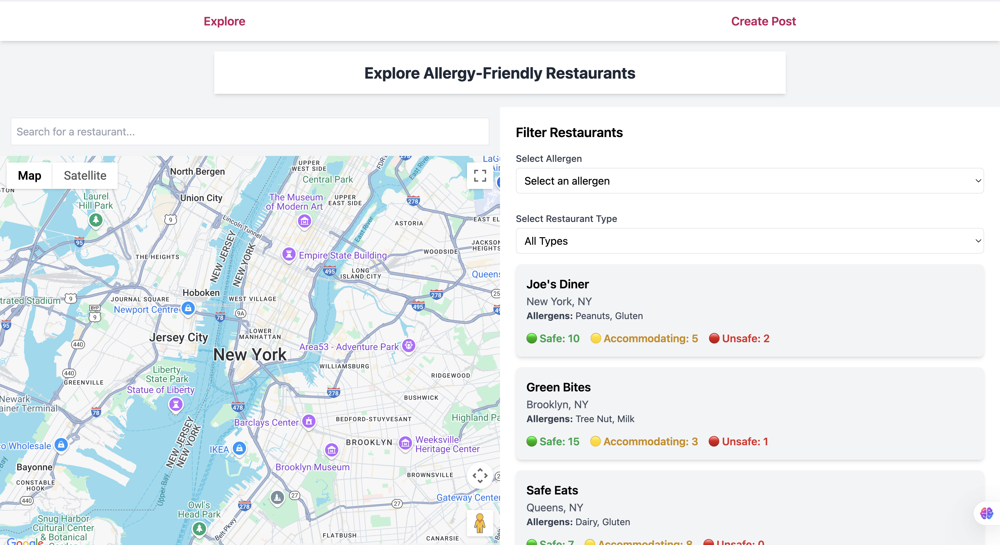
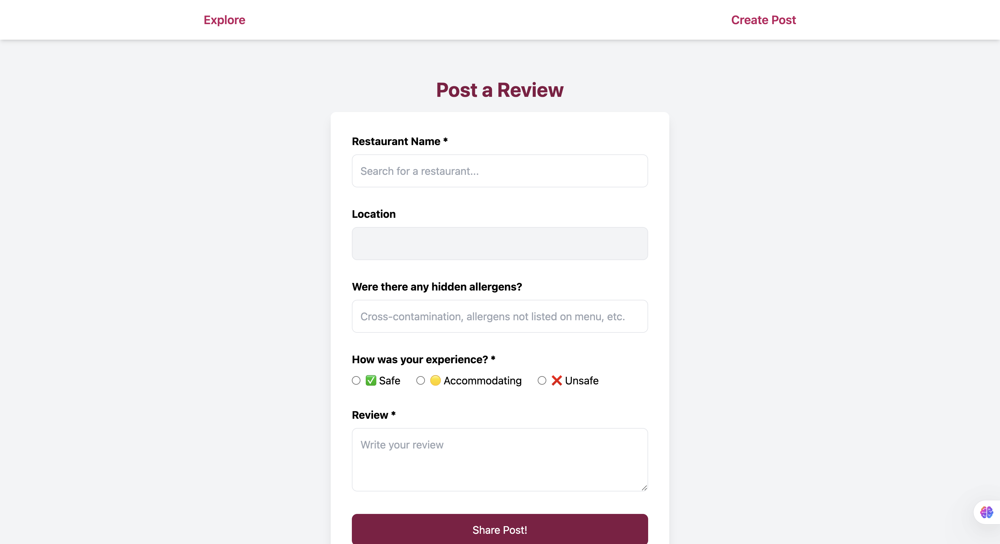

# Safe Bites

**Safe Bites** is a web application that helps users find and review allergy-friendly restaurants. It allows users to filter restaurants based on allergens, share their experiences, and contribute to a growing community of safe dining options.

---

## Features

✅ **User Authentication** – Sign in with Firebase authentication (Google, Email, etc.).  
✅ **Find Allergy-Friendly Restaurants** – Search and filter restaurants by allergens and restaurant type.  
✅ **Submit & View Reviews** – Users can leave reviews with safety ratings (`Safe`, `Accommodating`, `Unsafe`).  
✅ **Google Maps Integration** – Uses **Google Maps API** for restaurant lookup & location data.  
✅ **Dynamic Filtering** – Select allergens & restaurant types to see personalized recommendations.  

---

## Screenshots

### Explore Allergy-Friendly Restaurants


### Submit a Review


---

## Tech Stack

### **Frontend**
- **React.js** – UI framework  
- **Tailwind CSS** – Styling  
- **React Router** – Navigation  
- **Google Maps API** – Autocomplete & location data  

### **Backend**
- **Node.js + Express** – REST API  
- **PostgreSQL (Supabase) (In Progress)** – Database for structured restaurant & review data  
- **Firebase Auth (In Progress)** – User authentication  

---

## Installation & Setup

Follow these steps to set up and run Safe Bites on your local machine (Note front and backend are not fully connected yet).

### **1️⃣ Clone the Repository**
```sh
git clone https://github.com/kaylalaufer/safe-bites.git
cd safe-bites
```
### **2️⃣ Install Dependencies**
Run the following command inside the project folder:
```sh
yarn install  # or npm install
```

### **3️⃣ Set Up Environment Variables**
Create a .env file in the root of your project and add:

**Firebase Authentication**
```sh
REACT_APP_FIREBASE_API_KEY=your_firebase_api_key
REACT_APP_FIREBASE_AUTH_DOMAIN=your_firebase_auth_domain
REACT_APP_FIREBASE_PROJECT_ID=your_firebase_project_id
```
**Supabase (PostgreSQL Database)**
```sh
SUPABASE_URL=https://your_project.supabase.co
SUPABASE_KEY=your_supabase_secret_key
```

**Google Maps API - Needed for frontend**
```sh
REACT_APP_GOOGLE_MAPS_API_KEY=your_google_maps_api_key
```

### **4️⃣ Start the App**
Run the following command to launch the application:
```sh
yarn start  # or npm start
```